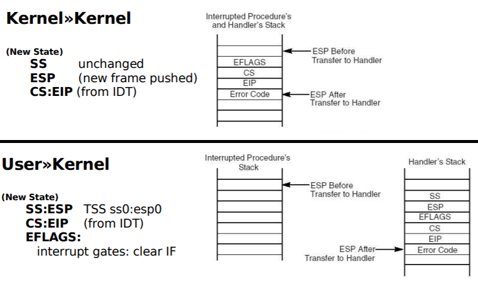

# lec 3 SPOC Discussion

## **提前准备**
（请在上课前完成）


 - 完成lec3的视频学习和提交对应的在线练习
 - git pull ucore_os_lab, v9_cpu, os_course_spoc_exercises  　in github repos。这样可以在本机上完成课堂练习。
 - 仔细观察自己使用的计算机的启动过程和linux/ucore操作系统运行后的情况。搜索“80386　开机　启动”
 - 了解控制流，异常控制流，函数调用,中断，异常(故障)，系统调用（陷阱）,切换，用户态（用户模式），内核态（内核模式）等基本概念。思考一下这些基本概念在linux, ucore, v9-cpu中的os*.c中是如何具体体现的。
 - 思考为什么操作系统需要处理中断，异常，系统调用。这些是必须要有的吗？有哪些好处？有哪些不好的地方？
 - 了解在PC机上有啥中断和异常。搜索“80386　中断　异常”
 - 安装好ucore实验环境，能够编译运行lab8的answer
 - 了解Linux和ucore有哪些系统调用。搜索“linux 系统调用", 搜索lab8中的syscall关键字相关内容。在linux下执行命令: ```man syscalls```
 - 会使用linux中的命令:objdump，nm，file, strace，man, 了解这些命令的用途。
 - 了解如何OS是如何实现中断，异常，或系统调用的。会使用v9-cpu的dis,xc, xem命令（包括启动参数），分析v9-cpu中的os0.c, os2.c，了解与异常，中断，系统调用相关的os设计实现。阅读v9-cpu中的cpu.md文档，了解汇编指令的类型和含义等，了解v9-cpu的细节。
 - 在piazza上就lec3学习中不理解问题进行提问。

## 第三讲 启动、中断、异常和系统调用-思考题

## 3.1 BIOS
- x86中BIOS从磁盘读入的第一个扇区是是什么内容？为什么没有直接读入操作系统内核映像？

  答：

  BIOS完成硬件初始化和自检之后，会根据CMOS中设置的启动顺序启动硬件，这里假设开始启动的是硬盘。由于文件系统还没有建立好，BIOS不知道哪里有操作系统，同时一个磁盘有多个分区，每个分区都可能有不同的操作系统，因而它也不知道应该把控制权交给谁。所有的BIOS都回读取0磁头0柱面1扇区的内容，把控制权交给这里的MBR。

- 比较UEFI和BIOS的区别。

  答：

  - UEFI是统一开扩展固件接口，是BIOS的一种替代方案
  - 二者的区别主要有3个方面：
    * 安全性：UEFI本身启动需要一个分区，将操作系统和系统启动文件隔离开来，本身更加安全
    * 配置更灵活：UEFI可以选择启动的文件，如果默认的配置出问题了，还可以手动选择U盘中的启动文件启动系统
    * 支持容量更大:BIOS由于MBR的容量限制，不支持2TB以上的硬盘，但UEFI可以，也是未来的趋势

- 理解rcore中的Berkeley BootLoader (BBL)的功能。

  答：

  一言以蔽之，运行中机器模式下 的BBL的主要作用是，处理用户模式和Linux操作系统都无法操作的程序。 目前主要有：

  1. RISCV处理器无法直接在硬件中处理的任何非法指令。
  2. 启动并响应定时器中断。
  3. 处理未对齐的内存访问。
  4. Linux启动时的链加载和初始控制台访问，以简化第一阶段引导加载程序。

  

## 3.2 系统启动流程

- x86中分区引导扇区的结束标志是什么？
  - 0x55aa
- x86中在UEFI中的可信启动有什么作用？
  - 启动前的检查机制确保介质安全
- RV中BBL的启动过程大致包括哪些内容？
  - 初始化硬件设备、建立内存空间的映射图，从而将系统的软硬件环境带到一个合适的状态，以便为最终调用操作系统内核准备好正确的环境

## 3.3 中断、异常和系统调用比较
- 什么是中断、异常和系统调用？
  - 中断：外部意外的响应；
  - 异常：指令执行意外的响应；
  - 系统调用：系统调用指令的响应
- 中断、异常和系统调用的处理流程有什么异同？
  - 相同
    - 都会进入异常服务例程，切换为内核态。
  - 不同
    - 源头不同，中断源是外部设备，异常和系统调用源是应用程序；
    - 响应方式不同，中断是异步的，异常是同步的，系统调用异步和同步都可以。
- 以ucore/rcore lab8的answer为例，ucore的系统调用有哪些？大致的功能分类有哪些？
  - 这段是抄的，没来得及看lab8
  - 进程管理：包括 fork/exit/wait/exec/yield/kill/getpid/sleep
  - 文件操作：包括 open/close/read/write/seek/fstat/fsync/getcwd/getdirentry/dup
  - 内存管理：pgdir命令
  - 外设输出：putc命令

## 3.4 linux系统调用分析
- 通过分析[lab1_ex0](https://github.com/chyyuu/ucore_lab/blob/master/related_info/lab1/lab1-ex0.md)了解Linux应用的系统调用编写和含义。(仅实践，不用回答)
- 通过调试[lab1_ex1](https://github.com/chyyuu/ucore_lab/blob/master/related_info/lab1/lab1-ex1.md)了解Linux应用的系统调用执行过程。(仅实践，不用回答)


## 3.5 ucore/rcore系统调用分析 （扩展练习，可选）
-  基于实验八的代码分析ucore的系统调用实现，说明指定系统调用的参数和返回值的传递方式和存放位置信息，以及内核中的系统调用功能实现函数。
- 以ucore/rcore lab8的answer为例，分析ucore 应用的系统调用编写和含义。
- 以ucore/rcore lab8的answer为例，尝试修改并运行ucore OS kernel代码，使其具有类似Linux应用工具`strace`的功能，即能够显示出应用程序发出的系统调用，从而可以分析ucore应用的系统调用执行过程。


## 3.6 请分析函数调用和系统调用的区别
- 系统调用与函数调用的区别是什么？
  - 汇编指令的区别
  - 安全性的区别
    - 系统调用有堆栈和特权级的转换过程，函数调用没有这样的过程，系统调用相对更为安全
  - 性能的区别
    - 时间角度：系统调用比函数调用要做更多和特权级切换的工作，所以需要更多的时间开销
    - 空间角度：如果函数调用采用静态编译，往往需要大量的空间开销，此时系统调用更具有优势

- 通过分析x86中函数调用规范以及`int`、`iret`、`call`和`ret`的指令准确功能和调用代码，比较x86中函数调用与系统调用的堆栈操作有什么不同？

  答

  * 指令功能：
    * **int**:软件触发中断
    * **iret**:中断返回，中断服务程序的最后一条指令。
    * **call**：计算机转移到调用的子程序。
    * **ret**：用栈中的数据，修改IP的内容，从而实现近转移
  * x86中函数调用与系统调用的堆栈操作的不同
    * int和iret指令是系统调用，需要从用户态转为内核态，需要用内核态下的堆栈来保存现场和恢复现场，安全性比函数调用的call ret更强
    * 主要的不同在于系统调用是将当前状态压到（或恢复于）内核态下的栈，而函数调用用的还是函数调用的栈，二者跳转和返回的地址区域不同
    * 如图：

- 通过分析RV中函数调用规范以及`ecall`、`eret`、`jal`和`jalr`的指令准确功能和调用代码，比较x86中函数调用与系统调用的堆栈操作有什么不同？

  答

  - 指令功能：
    - **ecall**:用于向支持的运行环境发出一个请求，这个运行环境通常是一个操作系统。
      系统的ABI将定义环境请求的参数是如何传递的，但通常这些参数应当是保存在整数寄存器
      中确定的位置。
    - **eret**:用于回归原来被中断的程序继续执行；eret指令会原子性地把中断响应打开（置SR(EXL)），并把状态级由kernel转到user级，并返回原地址继续执行。
    - **jal**:令使用了UJ类格式，此处J立即数编码了一个2的倍数的有符号偏移量。这个偏移量被符号扩展，加到pc上，形成跳转目标地址，跳转范围因此达到±1MB。
      JAL将跳转指令后面指令的地址（pc+4）保存到寄存器rd中。标准软件调用约定使用x1来作
      为返回地址寄存器。
    - **jalr**:使用I类编码。通过将12位有符号I类立即数加上rs1，然后将结果的最低位设置为0，作为目标地址。跳转指令后面指令的地址（pc+4）保存到寄存器rd中。如果不需要结果，则可以把x0作为目标寄存器。
  - x86中函数调用与系统调用的堆栈操作的不同
    - ecall和eret都是系统调用，它们用于改变特权级别的指令，它们将pc跳转到内核态下的特殊位置，并记录当前PC的位置，用于回来
    - jalr和jal是函数调用，也记录当前PC的位置，但是把信息记录在用户态下的堆栈中。


## 课堂实践 （在课堂上根据老师安排完成，课后不用做）
### 练习一
通过静态代码分析，举例描述ucore/rcore键盘输入中断的响应过程。

### 练习二
通过静态代码分析，举例描述ucore/rcore系统调用过程，及调用参数和返回值的传递方法。
